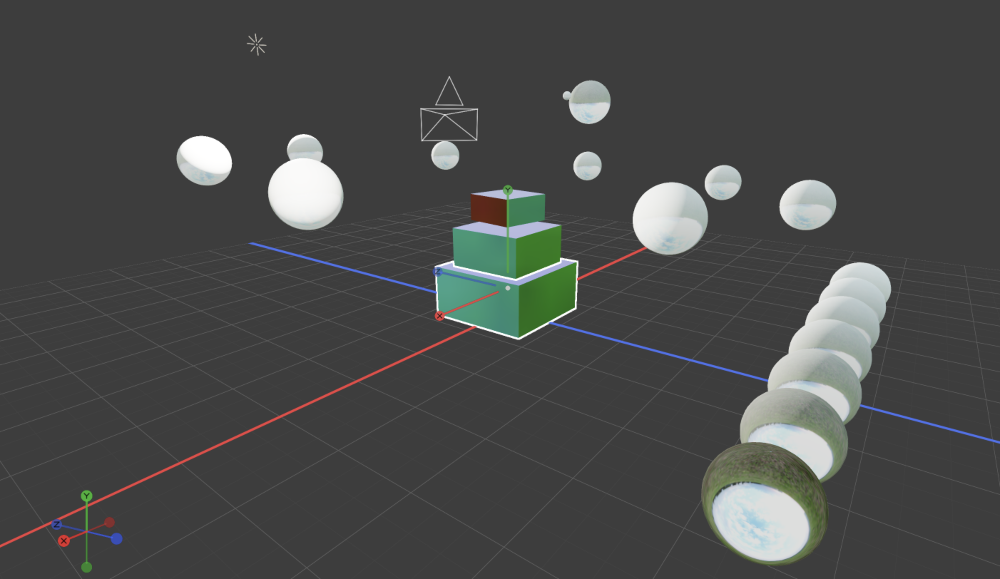
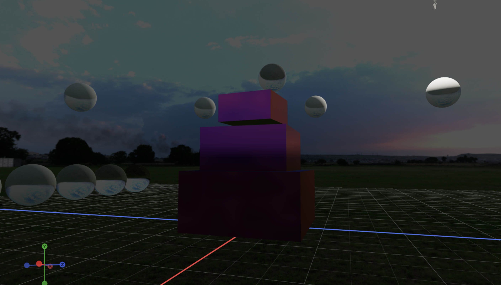

# Master of Puppets

Backend-agnostic viewport rendering engine in C11.

Master of Puppets renders 3D geometry through interchangeable backends — CPU software rasterization or Vulkan — behind a single public API with opaque handles. Designed as reusable infrastructure for DCC tools, custom editors, and embedded 3D viewports. The Vulkan backend features GGX Cook-Torrance PBR, HDRI image-based lighting, cascaded shadow mapping, GPU frustum + Hi-Z occlusion culling, async compute, bloom, SSAO, SSR, TAA, OIT, volumetric fog, and FXAA.

<p align="center">
  
</p>
<p align="center">
  
  
</p>

## Start here

Read **[docs/skill.mdx](docs/skill.mdx)** — self-contained entry point covering build, minimal render loop, capability matrix, full API walk-through, shading model, and common gotchas. It is the source of truth; this README is a marketing page.

## Usage

```c
#include <mop/mop.h>

MopViewport *vp = mop_viewport_create(&(MopViewportDesc){
    .width = 800, .height = 600,
    .backend = MOP_BACKEND_CPU,
    .ssaa_factor = 1,
});

mop_viewport_set_camera(vp,
    (MopVec3){ 0, 3, 8 }, (MopVec3){ 0, 0, 0 }, (MopVec3){ 0, 1, 0 },
    45.0f, 0.1f, 100.0f);

mop_viewport_add_light(vp, &(MopLight){
    .type = MOP_LIGHT_DIRECTIONAL,
    .direction = { -0.4f, -0.9f, -0.3f },
    .color = { 1, 0.95f, 0.9f, 1 },
    .intensity = 3.0f,
    .active = true,
});

MopMesh *mesh = mop_viewport_add_mesh(vp, &(MopMeshDesc){
    .vertices = verts, .vertex_count = nv,
    .indices  = idxs,  .index_count  = ni,
    .object_id = 1,
});
mop_mesh_set_position(mesh, (MopVec3){ 0, 0.5f, 0 });

mop_viewport_render(vp);
const uint8_t *pixels = mop_viewport_read_color(vp, &w, &h);

MopPickResult pick = mop_viewport_pick(vp, mouse_x, mouse_y);

mop_viewport_destroy(vp);
```

## Build

```bash
nix develop                   # Enter development shell (installs pre-commit hooks)
make                          # Build static library (build/lib/libmop.a)
make MOP_ENABLE_VULKAN=1      # Also build the Vulkan backend
make MOP_ENABLE_OPENGL=1      # Also build the OpenGL backend (stub)
make test                     # Run the test suite
make docs-check               # Validate docs + compile skill.mdx examples
```

Without Nix:

```bash
make CC=clang                 # or CC=gcc
```

## Examples

`examples/` is a separate flake (its own SDL2 devshell).

```bash
cd examples
nix run .#showcase            # 60 frames → /tmp/mop-showcase-out/
nix run .#interactive         # Live SDL window, Vulkan backend, HDRI skybox

# Or manually:
nix develop
make MOP_ENABLE_VULKAN=1 interactive
./build/examples/interactive --vulkan --hdri ~/Downloads/sunset.exr
```

## Switching backends

```c
.backend = MOP_BACKEND_CPU      /* Always available, deterministic      */
.backend = MOP_BACKEND_VULKAN   /* requires MOP_ENABLE_VULKAN=1 at build */
.backend = MOP_BACKEND_OPENGL   /* stub only — avoid for new work        */
.backend = MOP_BACKEND_AUTO     /* platform default                      */
```

On macOS the Vulkan backend runs via MoltenVK.

## Architecture

```
Application  →  Public API  →  Viewport Core  →  RHI  →  Backends
                            →  Interaction     →
```

The application sees only opaque handles and value types. The RHI is a function-pointer table that every backend implements. Backend selection is a runtime choice, no recompile needed.

See [docs/architecture.mdx](docs/architecture.mdx) for the layer contract and [docs/architecture/frame-lifecycle.mdx](docs/architecture/frame-lifecycle.mdx) for the render graph.

### Core systems

| System | Description |
|--------|-------------|
| **Viewport** | Scene management, render orchestration, framebuffer readback |
| **Scene pool** | Pointer-stable `MopMesh *` (caches survive any add/remove), TRS + matrix transforms, parent/child hierarchy, scene-lock for thread-safe mutation |
| **Instancing / LOD** | Instanced meshes with per-instance transforms, up to 8 LOD levels per mesh |
| **Skinning / morph** | Joint/weight skeletal animation, morph target deltas |
| **Materials** | GGX Cook-Torrance + Lambert, base color / metallic / roughness / normal / MR / AO textures. Optional material graph (DAG → flat material) with JSON round-trip |
| **Lights** | Directional / point / spot with Blender-matched intensity (SUN ×π, POINT ×4π²), physical 1/d² attenuation |
| **Environment** | HDRI (.hdr / .exr) + IBL (irradiance + prefiltered specular + BRDF LUT), procedural Preetham sky, auto-exposure |
| **Gizmo** | Translate / rotate / scale handles, DPI-aware tip sizing |
| **Input** | Event-driven interaction state machine — orbit, pan, zoom, drag, click-vs-drag, modifiers |
| **Selection** | Object-level + sub-element (vertex / edge / face) with edit modes |
| **Mesh edit** | Move, merge, split, dissolve, extrude, inset, flip — with normal re-compute |
| **Overlays** | Wireframe, normals, bounds, selection outline, skeleton — custom overlays register callbacks |
| **Picking** | Object-ID buffer for GPU pick; CPU AABB + Möller-Trumbore raycast for full surface hits |
| **Undo / Redo** | TRS + material history, batched entries |
| **Post-process** | Gamma, ACES tonemap, FXAA, bloom, SSAO, SSR, TAA, OIT, volumetric fog, vignette |
| **Shadows** | Cascaded shadow mapping (Vulkan) |
| **GPU culling** | Frustum + Hi-Z occlusion culling with meshlet clusters, async compute (Vulkan) |
| **Decals** | Deferred projective decals (Vulkan) |
| **Shader plugins** | SPIR-V plugins at named render-graph stages |
| **I/O** | OBJ loader, glTF 2.0 loader + importer, `.mop` v1 binary mesh format, `.mop` v2 full-scene format (mmap + quantized vertices) |
| **Export** | OBJ mesh / scene, JSON scene snapshot, PNG image |

## Extending

1. Implement the `MopRhiBackend` function-pointer table (~20 required + several optional — see [docs/reference/render/rhi.mdx](docs/reference/render/rhi.mdx)).
2. Register in `src/rhi/rhi.c`.
3. Add source to root `Makefile` behind a `MOP_ENABLE_<BACKEND>=1` flag.
4. Document at `docs/reference/render/backend-<name>.mdx`.

See [docs/architecture/extension.mdx](docs/architecture/extension.mdx) for the full guide.

## Documentation

- **[docs/skill.mdx](docs/skill.mdx)** — source-of-truth entry for building with MOP
- [docs/index.mdx](docs/index.mdx) — documentation root
- [docs/architecture.mdx](docs/architecture.mdx) — system architecture
- [docs/reference.mdx](docs/reference.mdx) — module API reference (grouped: core / interaction / render / query / io / util)
- [docs/development.mdx](docs/development.mdx) — build, platform, contributor guide

## License

Apache-2.0 — see [LICENSE](LICENSE).
